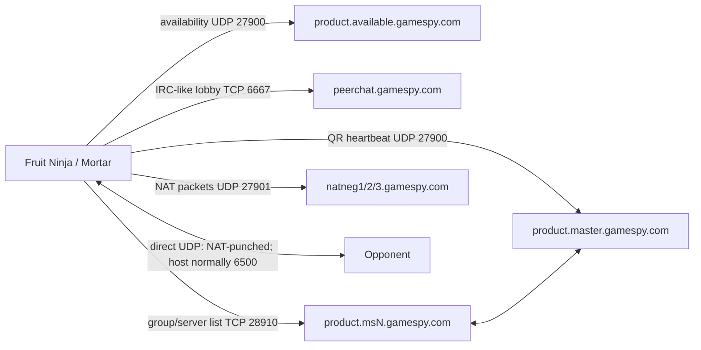

# Fruit Ninja 1.7.6 Android: GameSpy multiplayer analysis

## Scope

This document analyzes `Fruit Ninja 1.7.6.apk` statically. It answers whether the GameSpy protocol material in [GameSpyDocs](https://github.com/GameProgressive/GameSpyDocs) and [GameSpy-Openspy-Core](https://github.com/devzspy/GameSpy-Openspy-Core) is useful for restoring multiplayer, and maps the Android build's known server and peer-to-peer paths.

No device, emulator, live-server, or packet-capture test was performed.

### Artifact identity

| Property | Value |
|---|---|
| Package | `com.halfbrick.fruitninja` |
| Version | `1.7.6` (`versionCode` 1706) |
| APK SHA-256 | `5e94d16234504f5d2b6948b59371d8535c4364249b76e2533bba09114c808650` |
| Main activity | `com.halfbrick.mortar.MortarLVLGameActivity` |
| Native game library | `libmortargame.so` for `armeabi`, `armeabi-v7a`, and `x86` |
| x86 library SHA-256 | `223203cd256ef6e2471a817ef35bdb38bf6b3e9db45288a73d90794cc3d7232c` |
| Relevant permissions | `INTERNET`, `ACCESS_NETWORK_STATE`, `ACCESS_WIFI_STATE` |

Most gameplay and networking logic is native C/C++ in the stripped `libmortargame.so`. The Java DEX has no GameSpy client class and exposes no multiplayer JNI API; it loads and drives the Mortar native game through `NativeGameLib`. ARMv7 and x86 were analyzed independently. Offsets are labeled by architecture; ELF virtual addresses equal file offsets for the relevant `.text` and `.rodata` sections in both binaries.

### Confidence labels

- **Confirmed**: literal, cross-reference, or instruction sequence exists in the APK.
- **SDK-linked**: a complete GameSpy SDK path is present, but this pass did not prove that Fruit Ninja executes that particular optional branch.
- **Inference**: architecture implied by several confirmed observations but not yet validated dynamically.

## x86 follow-up analysis

The x86 library independently confirms the ARM findings and resolves the title registration that was previously missing. Its `.text` spans `0x302e0`–`0x36ca2c`, and `.rodata` spans `0x36ca40`–`0x39ff94`.

### Mortar resource decoding

`assets/xml/socialnetworks.xml` is not compressed XML. It is encrypted with a fixed repeating XOR stream:

```text
plain[i] = cipher[i] XOR table[i % 255]
```

The decoder loop is visible at x86 `0x249208`–`0x249235`. It computes `i % 255`, reads the key byte from `0x379a80`, and XORs it with the input. The same 255-byte table appears again at `0x379ba0`. A known plaintext/ciphertext pair already shipped in the APK—`musicdesc_u.xml` and `musicdesc.xml`—reproduces the table and verifies the algorithm. Applying it to `socialnetworks.xml` produces valid UTF-8 XML through the end of the file.

The relevant decrypted configuration is:

```xml
<provider id="GameSpy">
    <providerSettings product="SD" platform="android">
        <providerSetting id="SECRET_KEY" value="nNfhSl"/>
        <providerSetting id="NAME" value="FruitNinjaand"/>
    </providerSettings>

    <providerSettings product="SD" platform="win32">
        <providerSetting id="SECRET_KEY" value="eidtAc"/>
        <providerSetting id="NAME" value="FruitNinjapc"/>
    </providerSettings>

    <providerSettings product="freeSD" platform="android">
        <providerSetting id="SECRET_KEY" value="nNfhSl"/>
        <providerSetting id="NAME" value="FruitNinjaand"/>
    </providerSettings>
</provider>
```

This APK is package `com.halfbrick.fruitninja`, so the matching paid-phone stanza is `product="SD" platform="android"`. The free Android stanza intentionally uses the same GameSpy registration.

The Android GameSpy registration is therefore:

| Setting | Exact value |
|---|---|
| Game/title name | `FruitNinjaand` |
| QR secret | `nNfhSl` |
| Server Browser name | `FruitNinjaand` |
| Server Browser secret | `nNfhSl` |

Names and secrets are case-sensitive.

### Provider settings and Peer initialization

The x86 provider setting lookup at `0x2458a0` searches a `std::map<string,string>` stored at provider offset `+0x40` and returns the selected value. The multiplayer state machine uses it for:

- `NAME` at `0x1884d0` and `0x1886b6`.
- `SECRET_KEY` at `0x18869f`.

The main state dispatcher begins at `0x1882a0`; its 16-entry jump table is at `0x372160`. Confirmed states include:

| State | x86 target | Operation |
|---:|---:|---|
| 0 | `0x1884d0` | Read `NAME`, start availability check, transition to state 1. |
| 1 | `0x188508` | Poll availability; only the available result advances to state 2. |
| 2 | `0x188530` | Build `PEERCallbacks`, call `peerInitialize`, read both settings, call `peerSetTitle`, then connect anonymously. |
| 5 | `0x1888a8` | Start two-player Peer automatching. |
| 8 | `0x1882f8` | Create the host direct socket using `%s:6500`. |
| 9 | `0x1889b0` | Create the joining direct socket using `%s:%i`. |

The call at `0x188d0c` matches the published `peerSetTitle` signature exactly:

```c
peerSetTitle(
    peer,
    "FruitNinjaand", "nNfhSl",
    "FruitNinjaand", "nNfhSl",
    1,              // Server Browser game version
    20,             // maximum concurrent updates
    PEERTrue,       // NAT Negotiation enabled
    {1, 1, 1},      // ping Title, Group, and Staging rooms
    {1, 1, 1}       // cross-ping all three rooms
);
```

The connect call at `0x188d72` matches `peerConnect`, not `peerConnectLogin`:

```c
peerConnect(peer, generatedNick, 0, nickErrorCallback,
            connectCallback, manager, PEERFalse);
```

The profile ID is zero and the operation is asynchronous. This is direct evidence that the normal Android multiplayer path is anonymous and does not require GPCM/GPSP account authentication.

At `0x1888e7`, the manager calls the seven-argument `peerStartAutoMatch` form:

```c
peerStartAutoMatch(peer, 2, "", statusCallback,
                   rateCallback, NULL, PEERFalse);
```

The filter is empty, the player count is exactly two, and the operation is asynchronous. The rate callback at `0x1892b0` reads the candidate's `maxplayers` Server Browser key and returns true only when it equals 2.

### x86 transport confirmation

The x86 transport reproduces the ARM behavior instruction-for-instruction:

- `mortar` is the optional initial message passed to `gt2Connect` at `0x18a57b`; length is `-1` (use `strlen`), timeout is 10,000 ms, and the call is asynchronous.
- Incoming identification is checked at `0x18aa80`–`0x18aa99`; invalid peers receive `Coonection does not come from mortar.`.
- The `hbgs` reliable envelope is constructed at `0x18a6eb`–`0x18a70d`.
- ACK sequence matching and pending-message deletion occur at `0x18abfe`–`0x18ac55`.
- A received `0x3f` packet is changed to `0x7f`, its payload after byte 8 is delivered, and the expected receive sequence is incremented at `0x18ac79`–`0x18acd4`.
- The retry counter is decremented in the polling loop at `0x18adb8`–`0x18adcd`; expiration resets it to 30 and retransmits at `0x18aea0`–`0x18aeb2`.
- The receive loop compares the first six bytes with the NatNeg magic at `0x18ae5d`–`0x18ae92` before passing non-NatNeg traffic to the normal peer dispatcher.

No material disagreement with the ARM analysis was found. The x86 build adds clearer `GameSpyPlayer` and `SentMessage` C++ type names and makes the Peer call signatures recoverable, but uses the same registration, manager layout, direct socket formats, reliability header, and GameSpy SDK paths.


## Conclusion

The two repositories are directly useful. Fruit Ninja does not merely display a GameSpy logo: its native library contains the GameSpy Peer, PeerChat, Server Browsing, Query & Reporting, NAT Negotiation, and GT2-style transport paths described or implemented by those repositories. Endpoint templates, room names, QR keys, NAT packet magic, IRC-like commands, and master-server behavior agree closely.

They are not a complete restoration by themselves. The APK's title-specific registration has now been recovered: Android uses `NAME=FruitNinjaand` and `SECRET_KEY=nNfhSl`. OpenSpy's `Gamemaster.sql` contains no matching registration, so it must be added. OpenSpy also does not describe Fruit Ninja's Mortar gameplay payloads. Its server code contains incomplete or permissive paths and should be treated as executable protocol documentation, not a drop-in production server.

The smallest credible restoration target is:

1. Availability/QR on UDP 27900.
2. PeerChat on TCP 6667.
3. Server Browsing on TCP 28910, backed by QR registrations.
4. NAT Negotiation on UDP 27901.
5. Direct peer UDP transport, normally hosted on port 6500.

There is no static hostname evidence that Fruit Ninja needs GPCM, GPSP, GameStats, or SAKE for this multiplayer mode. Do not implement those first.

## Architecture



GameSpy supplies availability, lobby state, host advertisement/discovery, and NAT traversal. Gameplay data then moves directly between the two devices. It is not relayed through the GameSpy master services in the normal path.

## Endpoint inventory

All five hostname forms below are present in `libmortargame.so` and have code cross-references, not just certificate or resource mentions.

| Native literal | Expected transport/port | Role | Evidence |
|---|---:|---|---|
| `%s.available.gamespy.com` | UDP 27900 | Per-title backend availability check | **Confirmed** at `.rodata` `0x378540`; the resolver/send path starts near `0x1a0170` and formats the hostname at `0x1a0294`. The packet begins with type `0x09`. |
| `peerchat.gamespy.com` | TCP 6667 | Peer lobby, title/group/staging rooms, nick/login and room metadata | **Confirmed** at `0x378790`; default-host selection at `0x1c1638`. OpenSpy listens on 6667. |
| `%s.ms%d.gamespy.com` | TCP 28910 | Server Browser shard | **Confirmed** at `0x378b8c`; OpenSpy's Server Browsing implementation listens on 28910. |
| `%s.master.gamespy.com` | UDP 27900 | Query & Reporting / game advertisement | **Confirmed** at `0x378960`; GameSpyDocs and OpenSpy identify QR on UDP 27900. |
| `natneg1.gamespy.com`, `natneg2.gamespy.com`, `natneg3.gamespy.com` | UDP 27901 | NAT classification, endpoint exchange, and hole punching | **Confirmed** at `0x378664`–`0x37868c`; first resolver path at `0x1a7f4c`. |
| Peer address `%s:6500` or `%s:%i` | Direct UDP | Host and join transport | **Confirmed** at `0x3784a4` and `0x3784ac`; used by the Mortar multiplayer manager at `0x19cd0c` and `0x19cef8`. |

The `%s` in the GameSpy hostnames is the case-sensitive configured game name `FruitNinjaand`. The multiplayer manager looks up `NAME` and `SECRET_KEY` rather than embedding their values beside the code; the values come from the selected `SD`/`android` stanza in the encrypted provider XML.
The resulting title-specific hosts are `FruitNinjaand.available.gamespy.com`, `FruitNinjaand.master.gamespy.com`, and `FruitNinjaand.msN.gamespy.com`.

`8.8.8.8` also appears beside the socket helpers. Its surrounding code enumerates the local source IP using a UDP socket; this is not evidence that Google DNS is an application server.

## Connection and matchmaking flow

### 1. Native manager initialization

The Android activity initializes the Mortar native library. Native types recovered from dynamic C++ template symbols include:

- `Mortar::IMultiplayerUser`
- `Mortar::IMultiplayerMatch`
- `Mortar::IMultiplayerTurnBasedMatch`
- `Mortar::INetworkPacketChannel`
- `Mortar::NetworkManagerStatusMessageID`

The concrete manager is stripped, but its state machine is visible at ARM `0x19cc7c`–`0x19d818` and x86 `0x1882a0`–`0x188f90`. It reads `NAME`, starts the GameSpy availability path, creates a Peer session, configures the title, connects anonymously, starts two-player automatching, and creates or connects the peer socket.

### 2. Availability check

The SDK formats `<NAME>.available.gamespy.com`, resolves it, creates a UDP socket, and sends a GameSpy availability packet. The code stores network-order port 27900 (`0x6cfc`) and sends a request whose first protocol byte is `0x09`.

This matches GameSpyDocs' availability sequence and OpenSpy QR's `PACKET_AVAILABLE` handler. An unavailable or temporarily unavailable result can account for the game's `Unable to communicate with matchmaking servers.` UI error.

### 3. PeerChat lobby and rooms

The library contains the standard GameSpy PeerChat command set, including:

- `CRYPT des %d %s`
- `NICK`, `USER`, `LOGIN`, `LOGINPREAUTH`, and `REGISTERNICK`
- `JOIN`, `PART`, `WHO`, and `NAMES`
- `GETKEY`, `SETKEY`, `GETCHANKEY`, `SETCHANKEY`, `GETCKEY`, and `SETCKEY`
- `PRIVMSG`, `UTM`, and `ATM`
- `CDKEY`

The app-facing room labels are `TitleRoom`, `GroupRoom`, and `StagingRoom`. A player callback logs room, nick, public IP, and numeric ID with:

```text
PlayerInfoCallback : Room %s, Nick %s, IP %s, ID %d
```

This is the same three-level Peer room model represented by GameSpyDocs and OpenSpy. The game also has a generated-nick format `nick%u` and save fields `gsnick`, `gswins`, and `gsloss`.

Some login/CD-key strings may be optional SDK branches. Their presence alone does not prove that Fruit Ninja requires a GameSpy account or CD key. The absence of `gpcm.gamespy.com` and `gpsp.gamespy.com`, plus the generated nickname, supports an anonymous PeerChat path.

### 4. Host advertisement and discovery

The linked QR/Server Browser code contains the standard fields:

```text
hostname, gamename, gamever, hostport, mapname, gametype,
gamevariant, numplayers, maxplayers, numteams, gamemode,
password, groupid, localipN, localport, publicip, publicport,
natneg, statechanged, player_N, score_N, ping_N, team_N, pid_N
```

It also contains the Peer-specific mode `openstaging`. A host reports itself through QR, while Server Browsing returns group or staging candidates to the joining player. The master browser request supports the GameSpy filter and field-list model documented in both repositories.

The Mortar state machine constructs `<local/public IP>:6500` for hosting. The join path constructs `<peer IP>:<reported port>`. The Peer player callback's IP and ID are therefore part of the bridge from lobby discovery to the direct transport.

### 5. NAT Negotiation

Fruit Ninja includes all three NAT endpoints and routes packets beginning with this six-byte magic to its NAT Negotiation handler:

```text
FD FC 1E 66 6A B2
```

That is an exact match for GameSpyDocs and OpenSpy's `NNMagicData`. The shared protocol model is:

1. NAT type/external reachability checks against the three NatNeg hosts.
2. Address mapping checks.
3. Both peers submit `INIT` packets with a shared cookie and opposite client indexes.
4. The server returns each peer's public IP/port in `CONNECT` packets.
5. Peers exchange direct UDP pings and report the result.

OpenSpy defines the packet types used by this SDK generation: `INIT` 0, `INITACK` 1, `CONNECT` 5, `CONNECT_ACK` 6, `CONNECT_PING` 7, `ADDRESS_CHECK` 10, `ADDRESS_REPLY` 11, `NATIFY_REQUEST` 12, `REPORT` 13, and `REPORT_ACK` 14.

GameSpyDocs' response table calls `REPORT_ACK` value 15, while its prose and OpenSpy source imply 14. OpenSpy's source should win for implementation until a Fruit Ninja packet capture proves otherwise.

### 6. Direct peer transport

The direct transport is UDP and shares its socket with NAT Negotiation handling. Two independent markers are present:

- `mortar`: a six-character application marker checked with `strcmp` (the surrounding length check is seven bytes including the terminator); rejection text is misspelled `Coonection does not come from mortar.`
- `hbgs`: a four-byte Mortar reliability envelope constructed instruction-by-instruction at `0x19f744`–`0x19f788`.

The observed `hbgs` envelope is:

| Offset | Size | Meaning |
|---:|---:|---|
| 0 | 4 | ASCII `hbgs` |
| 4 | 2 | Little-endian sequence number |
| 6 | 1 | Constant `0x1e` |
| 7 | 1 | `0x3f` data/reliable request; changed to `0x7f` for acknowledgment |
| 8 | variable | Mortar payload |

Outgoing reliable data is copied after the eight-byte header and retained in a pending list. Incoming `0x3f` packets cause an acknowledgment; incoming `0x7f` packets remove the matching sequence from that pending list. The initial retry counter written into each pending packet is 30. An unreliable path sends the supplied payload without this envelope.

The same receive loop compares the first six bytes against the NatNeg magic before dispatching ordinary peer data. This is consistent with GameSpy's design: NatNeg opens the route, while the game/transport SDK owns gameplay reliability and packet channels.

The library contains `gti2CreateSocket` diagnostics and GT2 connection logic. GameSpyDocs concentrates on backend services and does not fully document this Fruit Ninja/Mortar payload layer. A relay does not need to understand it: after the NatNeg callback selects the relay endpoint, FruitSpy forwards the subsequent datagrams opaquely.

### 7. Fruit Ninja gameplay layer

The game contains a two-player mode identifier `VS_P2P`, two-player score/miss fields (`score_p%i`, `misses_p%i`), multiplayer disconnect handling, and Mortar packet-channel interfaces. Static evidence is sufficient to show live peer state crosses the direct transport, but not to publish a reliable application payload schema yet.

Strings such as `wave_counts_%s`, `waveIdx`, `game_count`, scores, misses, and timing fields occur in game serialization code. They may overlap save/replay and network serialization, so this document does not claim they are literal wire keys. Recovering channel IDs and individual gameplay packet layouts requires further native data-flow analysis or a later permitted packet capture.

## Comparison with the repositories

| Area | APK evidence | GameSpyDocs / OpenSpy correspondence | Assessment |
|---|---|---|---|
| Availability | `%s.available.gamespy.com`, UDP request type `0x09` | GameSpyDocs availability chapter; OpenSpy QR `handleAvailable` | Exact protocol family; useful immediately. |
| Peer rooms | `TitleRoom`, `GroupRoom`, `StagingRoom`, IRC-like commands | GameSpyDocs Peer diagrams; OpenSpy `peerchat/client.cpp` | Strong match. OpenSpy is the best executable reference for command behavior. |
| QR reporting | `%s.master.gamespy.com`, QR keys, `openstaging`, challenge error | GameSpyDocs QR chapters; OpenSpy `qr/Client.cpp` | Strong match. Required for host registration. |
| Server Browsing | `%s.ms%d.gamespy.com`, filters, group fields | GameSpyDocs request layout; OpenSpy `serverbrowsing/Client.cpp` | Strong match. Required for discovery/group listing. |
| NAT Negotiation | Three hosts and exact six-byte magic | GameSpyDocs NAT chapter; OpenSpy `natneg/structs.h` and `Client.cpp` | Exact SDK family. Required for internet peers behind NAT. |
| Direct transport | UDP 6500 host path, `mortar`, `hbgs`, GT2 diagnostics | Only broadly covered as GameSpy Transport/Peer; not handled by OpenSpy backend | Direct is the normal path; an unreachable path can be relayed opaquely after NatNeg selects the server endpoint. |
| Presence/account services | No GPCM/GPSP hostname | Repositories document them generically | Probably unnecessary for the first restoration target. |

## How useful OpenSpy is in practice

### Reusable or directly translatable

- Listener ports and service separation.
- Availability packet handling.
- PeerChat command parsing, room state, and GameSpy chat encryption helpers.
- Server Browser binary request parsing and enctype-X response support.
- QR heartbeat, key storage, challenge, and server-list handoff.
- NatNeg packet structs, magic, cookie matching, and endpoint exchange.
- Game registry/database shape and secret-key lookup model.

### Gaps and risks

1. **No Fruit Ninja registration.** Searches of OpenSpy's `Gamemaster.sql` found no entry matching the recovered `FruitNinjaand` name. A record with secret `nNfhSl` must be added.
2. **Registration is recovered, protocol selection is not fully labeled.** `peerSetTitle` parameters are known, but the exact Server Browser enctype branch and every optional QR/CD-key branch still need confirmation.
3. **OpenSpy is incomplete.** Its source contains TODOs and compatibility shortcuts. For example, the PeerChat `CDKEY` handler unconditionally authenticates, and NatNeg comments acknowledge incomplete game-aware matching.
4. **Paper inaccuracies exist.** The NatNeg `REPORT_ACK` discrepancy is one concrete example. Prefer server source and packet evidence over prose when they conflict.
5. **Generic SDK strings overstate used scope.** The static library contains optional login, CD-key, and query paths. Restoration should be driven by app-facing state-machine references and later packet evidence, not every linked command.
6. **No Fruit Ninja gameplay schema.** OpenSpy restores central GameSpy services, not the direct Mortar packet payloads.

## Restoration requirements and next static-analysis targets

### Resolved title data and remaining unknowns

The initial registration blocker is resolved:

- GameSpy `NAME`: `FruitNinjaand`
- GameSpy `SECRET_KEY`: `nNfhSl`
- Server Browser game version passed to Peer: `1`
- Server Browser maximum concurrent updates: `20`
- NAT Negotiation: enabled
- Room ping and cross-ping: enabled for all three room types
- Authentication: anonymous `peerConnect` with profile ID 0
- Automatch: two players, empty filter, candidate `maxplayers == 2`

The registration and primary Peer parameters are resolved. Remaining compatibility questions are optional CD-key reachability, exact client expectations for room metadata, and Fruit Ninja packet-channel/message layouts. Product and namespace IDs are not passed by the confirmed anonymous Peer path.

### Standalone server implementation

A separate implementation now exists under `server/`. It has no dependency on OpenSpy or another revival network at runtime. The process exposes:

- Availability and QR on UDP 27900.
- Encrypted GameSpy PeerChat on TCP 6667.
- Enctype-X Server Browsing on TCP 28910.
- Direct-first NAT Negotiation and bounded fallback relay on UDP 27901.
- Shared in-memory QR, server-list, chat-room, NatNeg, and ephemeral relay state.

The implementation uses `FruitNinjaand` / `nNfhSl`, anonymous PeerChat, two-player automatching, QR challenge validation, staging-host publication, encrypted Server Browser responses, cookie-based NatNeg pairing, and automatic relay fallback for an unconfirmed direct path. Run it from `server/` with:

```text
python -m fruitspy --config config.json
```

The automated suite exercises GameSpy cryptography, encrypted two-user PeerChat, QR registration, encrypted host discovery, two-client NatNeg pairing, direct-path cancellation, endpoint-authenticated opaque relay forwarding, hard relay TTL, byte and packet limits, and relay capacity. Live validation completed direct LAN gameplay under the `auto` policy plus two consecutive Wi-Fi/cellular relay games and a reverse-host relay game.

### Patched APK boundary

`server/apk-patch-map.json` records the authoritative hostname forms, service ports, patched ABIs, and selected LAN address. `server/patch_apk.py` performs a deterministic, size-preserving rewrite of the seven GameSpy hostname literals in `armeabi-v7a/libmortargame.so` and `x86/libmortargame.so`. It also patches the NatNeg resolver call paths so the numeric replacement is passed as an explicit hostname override; without that control-flow patch, the SDK prepends the game name and attempts to resolve invalid names such as `FruitNinjaand.192.168.100.2`. The current build uses `192.168.100.2` and preserves all original service ports. Direct opponent IP addresses returned by Server Browsing or NatNeg are runtime data and are not modified.

`Fruit Ninja 1.7.6 - FruitSpy LAN.apk` is rebuilt, zip-aligned, and signed with a legacy-compatible JAR-v1 signature plus an APK v3 signature. The `armeabi` library remains present and byte-for-byte identical to the original APK, as requested; Android devices that select that ABI still use the original GameSpy hostnames. The patch address is build-time configuration: rerun `patch_apk.py --server-host <IPv4>`, align, and sign the result when the LAN server address changes.

Verification confirms valid ARM and x86 ELF headers, exactly seven rewritten hostname locations per patched ABI, the expected NatNeg resolver instruction patches, no remaining `gamespy.com` hostname in those two libraries, unchanged non-target APK payloads, a valid APK manifest, all three ABI directories, and valid self-signed JAR-v1 and APK-v3 signatures. Runtime tracing on the Galaxy S4 and x86 emulator confirmed NatNeg UDP exchange with `192.168.100.2:27901`, direct peer traversal to `192.168.100.17`, and bidirectional gameplay transport packets.

Remaining static targets are `INetworkPacketChannel` message layouts, optional CD-key/LAN-discovery branches, and the eventual `armeabi` patch.

## Evidence locations in the APK

| Evidence | ARMv7 file/VA offset |
|---|---:|
| Multiplayer/room/GameSpy string cluster | `0x378430`–`0x37916c` |
| Availability hostname | `0x378540` |
| NatNeg hosts | `0x378664`–`0x37868c` |
| PeerChat hostname | `0x378790` |
| QR master hostname | `0x378960` |
| Server Browser hostname | `0x378b8c` |
| Direct host/join formats | `0x3784a4`, `0x3784ac` |
| Manager main state machine | `0x19cc7c`–`0x19d818` |
| `NAME` lookup | `0x19ce8c` |
| `SECRET_KEY` lookup | `0x19d574` |
| Availability resolver/send path | `0x1a0170`–`0x1a02f0` |
| `mortar` validation | `0x19fa34`–`0x19fab4` |
| `hbgs` send envelope | `0x19f720`–`0x19f7d8` |
| `hbgs` receive/ack handling | `0x19fb48`–`0x19fcdc` |
| NatNeg magic dispatch in peer receive loop | `0x19fe24`–`0x19fe58` |
| PeerChat default-host selection | `0x1c1638` |

| Evidence | x86 file/VA offset |
|---|---:|
| x86 string cluster | `0x37209f`–`0x372add` |
| Encrypted-resource XOR table | `0x379a80`–`0x379b7e` |
| Resource decoder loop | `0x249208`–`0x249235` |
| Provider setting lookup | `0x2458a0` |
| Manager state dispatcher | `0x1882a0`–`0x188f90` |
| Manager jump table | `0x372160` |
| `NAME` lookups | `0x1884d0`, `0x1886b6` |
| `SECRET_KEY` lookup | `0x18869f` |
| `peerSetTitle` argument setup/call | `0x188cc7`–`0x188d0c` |
| Anonymous `peerConnect` call | `0x188d33`–`0x188d72` |
| Two-player `peerStartAutoMatch` call | `0x1888a8`–`0x1888e7` |
| Automatch `maxplayers == 2` callback | `0x1892b0`–`0x1892ea` |
| `mortar` GT2 setup and validation | `0x18a550`–`0x18a5b5`, `0x18aa30`–`0x18aaad` |
| `hbgs` send/ACK implementation | `0x18a6b8`–`0x18a774`, `0x18ab70`–`0x18acd4` |
| NatNeg dispatch in receive loop | `0x18ae5d`–`0x18ae92` |

## Primary references

- [GameSpyDocs protocol paper source](https://github.com/GameProgressive/GameSpyDocs/blob/master/GameSpy%20Research/Research%20On%20GameSpy%20Protocol.tex)
- [OpenSpy QR handler](https://github.com/devzspy/GameSpy-Openspy-Core/blob/master/qr/Client.cpp)
- [OpenSpy QR constants](https://github.com/devzspy/GameSpy-Openspy-Core/blob/master/qr/main.h)
- [OpenSpy Server Browsing handler](https://github.com/devzspy/GameSpy-Openspy-Core/blob/master/serverbrowsing/Client.cpp)
- [OpenSpy Server Browsing constants](https://github.com/devzspy/GameSpy-Openspy-Core/blob/master/serverbrowsing/main.h)
- [OpenSpy PeerChat commands](https://github.com/devzspy/GameSpy-Openspy-Core/blob/master/peerchat/client.cpp)
- [OpenSpy NatNeg packet definitions](https://github.com/devzspy/GameSpy-Openspy-Core/blob/master/natneg/structs.h)
- [OpenSpy NatNeg handler](https://github.com/devzspy/GameSpy-Openspy-Core/blob/master/natneg/Client.cpp)
- [GameSpy Peer SDK interface](https://raw.githubusercontent.com/GameProgressive/UniSpySDK/master/Peer/peer.h)
- [GameSpy Transport 2 SDK interface](https://raw.githubusercontent.com/GameProgressive/UniSpySDK/master/gt2/gt2.h)
