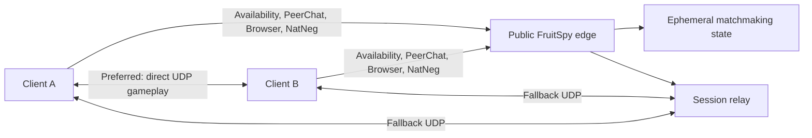

# FruitSpy Roadmap

## Objective

Extend the proven FruitSpy LAN implementation to Internet play without creating a second protocol stack or weakening LAN reliability. LAN remains a supported deployment topology and the regression baseline for every release.

## Compatibility contract

Every online-play change must preserve these LAN behaviors:

- Two unmodified patched clients can discover each other through Availability/QR2, PeerChat, Server Browsing, and NatNeg.
- A locally hosted server requires no database, external identity provider, DNS service, or Internet connection.
- Direct peer traffic remains the default when both devices are mutually reachable.
- The existing ports and wire formats remain compatible with Fruit Ninja 1.7.6.
- `python -m unittest` and a two-device LAN smoke test must pass before an online milestone is accepted.

Use one direct-connect configuration and publish server-observed host endpoints in every deployment. Do not fork the LAN implementation or introduce topology-specific address heuristics.

## Target architecture

Initial online deployment should remain a single process on one host with a static public IPv4 address. Matchmaking state is short-lived, so durable storage is not required for the first Internet milestone. Split services or add shared storage only when measured availability or scaling requirements justify it.

## Development status

The direct-first service and bounded relay fallback are deployed:

- Replaced the split `lan` and `internet` profiles with one direct-connect configuration.
- Published the server-observed QR2 source address and port for every host, including hosts behind port-mapping NAT.
- Routed Server Browser send-message requests to the registered QR2 source endpoint rather than trusting the requested destination.
- Added strict frame and datagram sizes, total and per-source TCP admission caps, bounded per-source QR2/NatNeg token buckets, and absolute handshake/frame deadlines.
- Added stable connection identifiers and structured connection events. Debug logs omit chat bodies, nicknames, quit reasons, and raw Server Browser frames.
- Extended the APK patch target to accept a short DNS name or IPv4 address.
- Added regression coverage for unified configuration validation, observed endpoint encoding, QR2 relay routing, oversized inputs, admission limits, UDP rate limiting and refill, idle clients, malformed-datagram recovery, and post-rejection listener recovery.
- Added a four-protocol readiness command, hardened systemd unit, nftables allowlist example, guarded deployment runbook, two-network acceptance matrix, and structured NatNeg lifecycle events.
- Deployed the guarded service on a public IPv4 VPS and verified all four protocols from both the host and an external network.
- Added structured NatNeg `INIT` socket metadata and client outcome logging.
- Compared a completed LAN game with a failed Wi-Fi/cellular session. The LAN sockets exchanged NatNeg, `hbgs`, and gameplay traffic; the Internet trace sent nine peer-directed NatNeg packets without receiving one and never reached `hbgs`.
- Added automatic fallback on the existing UDP 27901 listener. A synthetic NatNeg peer response moves only unconfirmed sessions to an opaque two-endpoint relay after three seconds.
- Bounded relay allocations by hard TTL, packet size, per-endpoint byte rate and burst, global session count, exact endpoint admission, and NatNeg endpoint proof.
- Completed two consecutive Wi-Fi/cellular games plus a reverse-host game through the relay. Re-ran LAN gameplay under the same `auto` policy; both direct reports arrived within 27 ms and no relay was allocated.
- Implemented GameSpy `PUSH_UPDATES` delivery for newly registered and changed QR2 hosts. Automatch now publishes the oldest compatible open host, preventing clients that searched an empty list simultaneously from both remaining hosts or cross-joining newly created rooms. The regression passed 20 repeated runs plus host-full rotation, host removal, and recovery checks. Through the public VPS, a synthetic same-egress two-browser/two-QR probe and three real-device games passed: simultaneous entry, Galaxy S4 first, and Galaxy S20 first.

Next: retain the direct and relay acceptance matrix while beginning Phase 4 public-service hardening.

## Phase 1 — Freeze the LAN baseline

Purpose: make the current checkpoint reproducible before expanding its exposure.

- Keep protocol fixtures for the observed Fruit Ninja 1.7.6 messages and the NatNeg resolver patches.
- Add a concise operator runbook covering bind address, client patch target, firewall rules, startup, shutdown, and log collection.
- Add a repeatable two-device smoke checklist: host registration, discovery, staging-room exchange, NatNeg pairing, direct gameplay, rematch, and clean disconnect.
- Record supported APK hash inputs and patcher output metadata without distributing proprietary binaries.
- Separate checked-in example configuration from machine-local configuration.

Exit criteria:

- A clean checkout can run the tests and start a LAN server from documented commands.
- Two LAN devices complete at least three consecutive games and a rematch.
- No APK, signing key, packet capture, or local UI dump is tracked by Git.

## Phase 2 — Internet direct-connect alpha

Purpose: prove the current protocols across two independent networks before adding relay complexity.

- Extend APK patch configuration to accept a stable DNS name as well as an IPv4 address. Preserve the NatNeg explicit-host override so the game name is never prepended.
- Use one direct-connect server configuration for LAN, home-hosted, and VPS deployments. Keep the client APK patch target independent from server socket binding.
- Deploy one IPv4 host with TCP 6667 and 28910 plus UDP 27900 and 27901 reachable from the Internet.
- Add strict packet-size limits, connection limits, idle timeouts, and per-source rate limits before exposing the legacy protocols publicly.
- Reject malformed QR2, Server Browser, PeerChat, and NatNeg messages without terminating a listener.
- Add structured session identifiers to logs while avoiding chat payload retention and unnecessary IP retention.
- Add process supervision, startup health checks, and firewall rules. A separate web control plane is not required.

Exit criteria:

- Devices on two different residential networks discover each other and complete direct NatNeg traversal.
- Existing LAN configuration produces byte-compatible responses and passes the LAN smoke test.
- Malformed-packet and connection-flood tests leave all four listeners responsive.

Known limitation: direct traversal will fail for some symmetric NAT, carrier-grade NAT, and restrictive mobile networks. That is an expected alpha limitation, not a reason to change the LAN path.

Observed limitation: a Wi-Fi/cellular trial completed every server-side phase but produced only one-way peer UDP traffic. The direct-connect exit criterion remains unmet for that network pair, and the evidence gate for Phase 3 relay work is satisfied.

## Phase 3 — Relay fallback

Purpose: support peers that cannot establish a direct UDP path.

- Capture and document NatNeg behavior across full-cone, restricted-cone, port-restricted, symmetric, and carrier-grade NAT where test access is available.
- Add an `auto` NatNeg policy: attempt direct traversal first, then return a relay endpoint only after a bounded timeout.
- Implement a minimal UDP session relay keyed by the existing NatNeg cookie and the two server-observed endpoints. Require both endpoints to complete the expected NatNeg exchange before forwarding gameplay.
- Allocate relay state with hard TTL, byte-rate limits, packet-size limits, and global capacity limits.
- Prevent third-party injection by accepting traffic only from the paired, server-observed endpoints after each returns the expected cookie-bearing NatNeg ping.
- Keep relay payloads opaque. The relay must not parse or modify `hbgs` gameplay messages.
- Expose relay use, duration, bytes, drops, and expiry as aggregate metrics.

Status: implemented and deployed. The available matrix covers direct LAN, residential Wi-Fi to cellular relay, consecutive relay games, and both hosting directions. Additional NAT types remain opportunistic coverage rather than a release blocker.

Exit criteria:

- Direct-capable peers still communicate directly.
- A deliberately blocked direct path completes multiple games through the relay.
- Loss of relay state ends only the affected match and cannot corrupt other sessions.
- Direct-connect sessions never allocate relay state unless relay fallback is explicitly configured.

## Phase 4 — Correctness and public-service hardening

Purpose: close the known matchmaking and abuse-resistance gaps before inviting anonymous public traffic.

### Matchmaking correctness

- [x] Correct the simultaneous empty-list automatch race with live Server Browser push updates and deterministic oldest-open-host publication. The shared public IP was the observed topology, not the identity collision.
- [x] Add an integration scenario with two QR2 registrations sharing a public IP but using distinct observed ports, private addresses, and local ports.
- [x] Complete same-egress real-device games in both hosting directions through the public VPS.
- [x] Define and test NatNeg behavior for cookie collisions, duplicate peer indexes, spoofed initialization, and third-peer injection. Active cookies now use first-claim-wins endpoint ownership: exact duplicate INITs refresh the claim; conflicting occupied indexes, one endpoint claiming both indexes, and third endpoints after pairing or relay activation are rejected without a reply or state mutation; expired cookies can be reclaimed.
  Protocol boundary: before both indexes are claimed, an endpoint presenting the cookie for the still-open index is indistinguishable from the intended peer because the stock INIT carries no stronger identity proof. The server therefore preserves the first accepted claim for each index rather than claiming authentication the wire format cannot provide.
- [x] Test direct-success reports that race the three-second automatic relay boundary. The first definitive server-observed outcome wins: direct success before any relay endpoint returns its cookie-bearing ping closes the speculative relay, while a returned relay ping commits subsequent success reports to the relay. Deterministic tests cover reports before fallback activation, immediately after activation, and after relay readiness.

### State and abuse resistance

- [x] Reject duplicate PeerChat nicknames deterministically.
- [x] Enforce the two-player staging-room limit server-side. A third unique participant receives IRC numeric `471`, does not enter channel state, and may join after a participant leaves; title rooms remain unrestricted by this game-specific limit.
- [x] Bound channels per client, total channels, and all channel/client/user key collections. Defaults cap live channels at 1024, memberships at 16 per client, and each key dictionary at 64 entries; rejected multi-key updates are atomic, per-channel client-key and operator maps cannot grow beyond actual membership, and released channels restore capacity.
- [x] Add per-client command and state-creation budgets so one admitted connection cannot exhaust memory. Token buckets default to 30 commands/second with a 60-command burst and 8 state creations/second with a 32-entry burst; command exhaustion disconnects before buffered commands continue, while state exhaustion atomically rejects new nick, channel, membership, operator, or key entries without blocking updates to existing state.
- [x] Make reported-server and NatNeg expiry run independently of new client traffic. A supervised five-second state sweeper removes expired QR2 and NatNeg setup entries, emits aggregate expiry diagnostics, and notifies Server Browser subscribers when registered hosts disappear. Authenticated relay activity refreshes retained NatNeg setup state, while expiry of an inactive setup record does not terminate its independently bounded relay.
- [x] Add configurable global UDP admission budgets and temporary source bans. QR2 and NatNeg now share a 4096 packet/second global bucket, an 8192-packet aggregate burst, and one bounded per-source table. A source that continues after exhausting its 120 packet/second, 240-packet burst is banned across both listeners for 60 seconds after 30 consecutive rejections; global exhaustion never creates source strikes, and structured rejection reasons distinguish each admission boundary.
- [x] Confirm and remove unconditional `CDKEY` acceptance, and document the anonymous authentication boundary. Static cross-reference analysis of all three packaged ABIs found the linked SDK's CD-key API unreachable from title code. A fresh two-device public match traced both PeerChat sessions from `CRYPT` through `QUIT` with zero `CDKEY` commands and no protocol rejections. FruitSpy now returns the standard unknown-command response instead of claiming authentication; display names remain connection-scoped labels, and protocol secrets, QR2 proofs, NatNeg claims, and source addresses are not player identities or license checks.
- [ ] Sanitize externally controlled log fields against control-character and log-injection attacks.
- [ ] Measure QR2 and NatNeg amplification and cap any unsafe response ratios.

### Operations and failure testing

- [ ] Add privacy-preserving metrics for active clients, rooms, discovery, NatNeg outcomes, relay outcomes, latency, errors, and admission rejection.
- [ ] Add graceful drain behavior: stop new matchmaking while allowing existing direct games to continue and reporting relay shutdown explicitly.
- [ ] Fuzz QR2, NatNeg, Server Browser, encrypted PeerChat, and filter inputs.
- [ ] Run concurrent connection, room, packet, and relay load tests to the configured capacity limits.
- [ ] Exercise packet loss, reordering, duplicates, delay, abrupt client death, reconnect, process restart, and isolated relay-state loss.
- [ ] Verify that the 15-minute hard relay TTL cannot terminate a legitimate supported game.
- [ ] Complete the remaining network matrix: two residential NATs and mixed local/remote home hosting. Additional NAT types remain opportunistic after those cases pass.

Exit criteria:

- [x] Same-egress clients complete games in both hosting directions.
- [ ] Resource use remains bounded under the documented load envelope.
- [ ] Fuzzed and spoofed inputs do not crash listeners, cross-wire peers, or leak state across sessions.
- [ ] Operators can distinguish discovery, negotiation, direct-connect, relay, and client-side failures from metrics and logs.

## Phase 5 — Deterministic client patching and public release

Purpose: publish a reproducible preservation project without redistributing proprietary material or coupling users to the development VPS.

### Unified client patch pipeline

- [ ] Replace the endpoint-patcher/clock-patcher chain with one deterministic pipeline that starts from an allowlisted Fruit Ninja 1.7.6 APK hash.
- [ ] Apply the configurable FruitSpy endpoint and monotonic clock correction in a defined order within that pipeline.
- [ ] Ensure every retained ABI receives both required transformations; either implement the endpoint patch for `armeabi` or explicitly remove that ABI from the supported contract.
- [ ] Reject unsupported or modified whole APKs before writing output, not only unexpected native-library bytes.
- [ ] Produce an unsigned APK and machine-readable manifest containing input, output, per-library, payload, and tool-version hashes.
- [ ] Keep signing separate and document alignment plus signing with a user-owned key.
- [ ] Consume the compatibility project as source/tooling; never copy its APK inputs, APK outputs, or extracted proprietary libraries into this repository.
- [ ] Add automated composition tests for IPv4 and short-DNS endpoint targets across every supported ABI.

### Repository and release hygiene

- [ ] Replace `server/apk-patch-map.json` and `server/apk-patch-report.json` with host-neutral reproducible fixtures or remove generated operator output from version control.
- [ ] Choose and add a project license; do not assume a license without owner approval.
- [ ] Publish source, tests, protocol notes, and deterministic patch tooling only.
- [ ] Never publish Fruit Ninja APKs, extracted native libraries, signing keystores, signing passwords, packet captures, or copyrighted game assets.
- [ ] Add a security policy, responsible-disclosure contact, contribution guidelines, and a supported-version/topology statement.
- [ ] Document the legacy protocol's lack of modern transport security, operational IP logging, retention policy, and data-minimization controls.
- [ ] Run full Git-history secret/proprietary-artifact scanning and dependency review.
- [ ] Correct all status documents and manifests to match the release candidate.
- [ ] Push the deployed local commits, tag the accepted checkpoint, and publish versioned alpha checksums and migration notes.
- [ ] Complete legal and trademark review before changing repository visibility.

Exit criteria:

- [ ] A clean checkout reproduces the patch from a user-supplied lawful APK without using a project-owned signing key.
- [ ] Secret scanning, dependency review, and legal review are accepted.
- [ ] Automated tests plus LAN, same-egress, and independent-network smoke matrices pass against the exact release candidate.
- [ ] Repository visibility changes only after the owner approves the license and release review.

## Deferred capabilities

These are not prerequisites for online play:

- Match history, winner, and score reporting. Gameplay is peer-to-peer and FruitSpy currently receives no authoritative result.
- Persistent user accounts, rankings, or moderation identities.
- Multi-region matchmaking and cross-region relay selection.
- Horizontal service splitting or a durable distributed state store.
- Support for Fruit Ninja versions other than 1.7.6 or the untouched legacy `armeabi` library.

Add these only after the single-node online path is proven and their protocol, operational, and privacy costs are understood.
