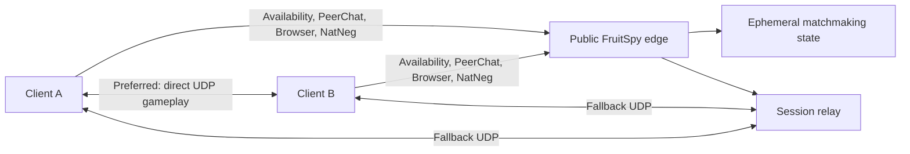

# FruitSpy Roadmap

## Objective

Extend the proven FruitSpy LAN implementation to Internet play without creating a second protocol stack or weakening LAN reliability. LAN remains a supported deployment profile and the regression baseline for every release.

## Compatibility contract

Every online-play change must preserve these LAN behaviors:

- Two unmodified patched clients can discover each other through Availability/QR2, PeerChat, Server Browsing, and NatNeg.
- A server configured with a private IPv4 address requires no database, external identity provider, DNS service, or Internet connection.
- Direct peer traffic remains the default when both devices are mutually reachable.
- The existing ports and wire formats remain compatible with Fruit Ninja 1.7.6.
- `python -m unittest` and a two-device LAN smoke test must pass before an online milestone is accepted.

Use one protocol core with explicit `lan` and `internet` deployment profiles. Do not fork the LAN implementation or introduce online-only behavior through implicit address heuristics.

## Target architecture

Initial online deployment should remain a single process on one host with a static public IPv4 address. Matchmaking state is short-lived, so durable storage is not required for the first Internet milestone. Split services or add shared storage only when measured availability or scaling requirements justify it.

## Development status

Online direct-connect foundation is in progress:

- Implemented explicit `lan` and `internet` configuration profiles.
- Preserved the reported game port in LAN mode while publishing the server-observed QR2 source port in Internet mode, which is required when a host is behind port-mapping NAT.
- Routed Server Browser send-message requests to the registered QR2 source endpoint rather than trusting the requested destination.
- Added strict frame and datagram sizes, total and per-source TCP admission caps, bounded per-source QR2/NatNeg token buckets, and absolute handshake/frame deadlines.
- Added stable connection identifiers and structured Internet-mode connection events. Internet debug logs omit chat bodies, nicknames, quit reasons, and raw Server Browser frames.
- Extended the APK patch target to accept a short DNS name or IPv4 address.
- Added regression coverage for profile validation, observed public-port encoding, online QR2 relay routing, oversized inputs, admission limits, UDP rate limiting, and idle clients.

Next: process supervision, startup health checks, firewall deployment, malformed-input resilience expansion, and a controlled two-network direct-connect test. The Internet profile remains a guarded development profile until that deployment validation succeeds.

## Phase 1 — Freeze the LAN baseline

Purpose: make the current checkpoint reproducible before expanding its exposure.

- Keep protocol fixtures for the observed Fruit Ninja 1.7.6 messages and the NatNeg resolver patches.
- Add a concise operator runbook covering bind address, advertised address, firewall rules, startup, shutdown, and log collection.
- Add a repeatable two-device smoke checklist: host registration, discovery, staging-room exchange, NatNeg pairing, direct gameplay, rematch, and clean disconnect.
- Record supported APK hash inputs and patcher output metadata without distributing proprietary binaries.
- Separate checked-in example configuration from machine-local configuration.

Exit criteria:

- A clean checkout can run the tests and start a LAN server from documented commands.
- Two LAN devices complete at least three consecutive games and a rematch.
- No APK, signing key, packet capture, or local UI dump is tracked by Git.

## Phase 2 — Internet direct-connect alpha

Purpose: prove the current protocols across two independent networks before adding relay complexity.

- Extend APK patch configuration to accept a stable DNS name as well as an IPv4 address. Preserve the NatNeg explicit-host override so the game name is never prepended.
- Add explicit deployment settings for `mode`, public advertised IPv4 address, and trusted proxy/network boundaries. Keep the existing LAN defaults.
- Deploy one IPv4 host with TCP 6667 and 28910 plus UDP 27900 and 27901 reachable from the Internet.
- Add strict packet-size limits, connection limits, idle timeouts, and per-source rate limits before exposing the legacy protocols publicly.
- Reject malformed QR2, Server Browser, PeerChat, and NatNeg messages without terminating a listener.
- Add structured session identifiers to logs while avoiding chat payload retention and unnecessary IP retention.
- Add process supervision, startup health checks, and firewall rules. A separate web control plane is not required.

Exit criteria:

- Devices on two different residential networks discover each other and complete direct NatNeg traversal.
- Existing LAN configuration produces byte-compatible responses and passes the LAN smoke test.
- Malformed-packet and connection-flood tests leave all four listeners responsive.

Known limitation: direct traversal will fail for some symmetric NAT, carrier-grade NAT, and restrictive mobile networks. That is an expected alpha limitation, not a reason to change the LAN path.

## Phase 3 — Relay fallback

Purpose: support peers that cannot establish a direct UDP path.

- Capture and document NatNeg behavior across full-cone, restricted-cone, port-restricted, symmetric, and carrier-grade NAT where test access is available.
- Add an `auto` NatNeg policy: attempt direct traversal first, then return a relay endpoint only after a bounded timeout.
- Implement a minimal UDP session relay keyed by a server-generated, short-lived session token and the two observed peer endpoints.
- Allocate relay state with hard TTL, byte-rate limits, packet-size limits, and global capacity limits.
- Prevent third-party injection by accepting traffic only from the paired endpoints after each endpoint proves possession of the session token or completes the expected NatNeg exchange.
- Keep relay payloads opaque. The relay must not parse or modify `hbgs` gameplay messages.
- Expose relay use, duration, bytes, drops, and expiry as aggregate metrics.

Exit criteria:

- Direct-capable peers still communicate directly.
- A deliberately blocked direct path completes multiple games through the relay.
- Loss of relay state ends only the affected match and cannot corrupt other sessions.
- LAN mode never allocates relay state unless explicitly configured to do so.

## Phase 4 — Public-service hardening

Purpose: operate an anonymous legacy protocol safely enough for a limited public release.

- Threat-model nickname abuse, room flooding, oversized frames, spoofed UDP, NatNeg cookie collisions, amplification, resource exhaustion, and log injection.
- Bound all in-memory collections and make expiry work independent of new client traffic.
- Add deterministic nickname-collision handling and enforce the two-player room limit server-side.
- Add temporary source bans and configurable global admission limits. Avoid permanent accounts until real abuse data demonstrates a need.
- Add privacy-preserving operational metrics: active clients, rooms, discovery requests, NatNeg outcomes, relay outcomes, latency, and error counts.
- Add graceful shutdown and drain behavior so new matchmaking stops while active direct games remain unaffected.
- Exercise restart, packet loss, duplicate UDP packets, delayed packets, abrupt client death, and reconnect behavior.

Exit criteria:

- Resource use remains bounded under the documented load envelope.
- Fuzzed protocol inputs do not crash listeners or leak state across sessions.
- Operators can distinguish discovery, negotiation, relay, and client-side failures from metrics and logs.

## Phase 5 — Packaging and public release

Purpose: publish a maintainable preservation project without redistributing proprietary material.

- Choose and add a project license; do not assume a license without owner approval.
- Publish source, tests, protocol notes, and the deterministic patcher only.
- Never publish Fruit Ninja APKs, extracted native libraries, signing keystores, signing passwords, or copyrighted game assets.
- Replace development signing metadata with instructions for users to create and protect their own key.
- Add a security policy, responsible-disclosure contact, contribution guidelines, and a supported-version statement.
- Document that the legacy game protocol does not provide modern transport security and that the service should collect minimal data.
- Tag the current LAN checkpoint, then issue versioned online alpha releases with checksums and migration notes.
- Perform a final legal and trademark review before changing the GitHub repository from private to public.

Exit criteria:

- A release can be reproduced from public source plus a user-supplied lawful APK.
- Secret scanning and dependency review are clean.
- LAN and Internet smoke matrices pass against the release candidate.
- Repository visibility changes only after the owner approves the license and release review.

## Deferred capabilities

These are not prerequisites for online play:

- Match history, winner, and score reporting. Gameplay is peer-to-peer and FruitSpy currently receives no authoritative result.
- Persistent user accounts, rankings, or moderation identities.
- Multi-region matchmaking and cross-region relay selection.
- Horizontal service splitting or a durable distributed state store.
- Support for Fruit Ninja versions other than 1.7.6 or the untouched legacy `armeabi` library.

Add these only after the single-node online path is proven and their protocol, operational, and privacy costs are understood.
